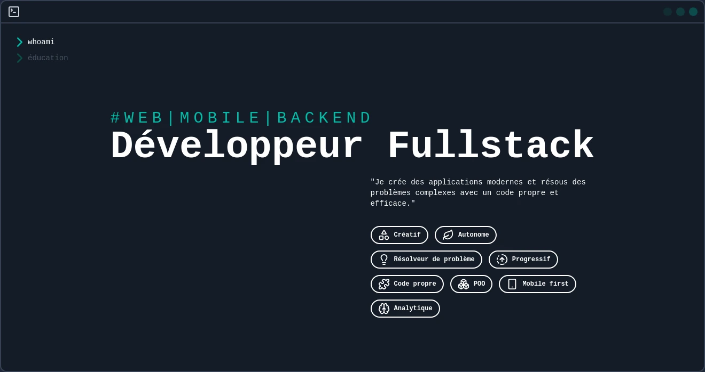

 

 
<h1 style="font-size: 24px;"> ( *-*)   I'm Rotsiniaina RAMANANTSOA 🇲🇬
</h1>

<h1><h1>
 

 

    
 

 
  
  
 
<bt>

     
 
 

 

 
   
 

 

  
    

<!-- 

    <a href="https://ossinsight.io/analyze/noobieram">
        <picture>
        <source media="(prefers-color-scheme: dark)" srcset="https://github-readme-activity-graph.vercel.app/graph?username=noobieram&theme=react-dark&hide_border=true&hide_title=false&area=true&custom_title=Total%20contribution%20graph%20in%20all%20repo" >
                            
        </picture>
    </a>

 -->
